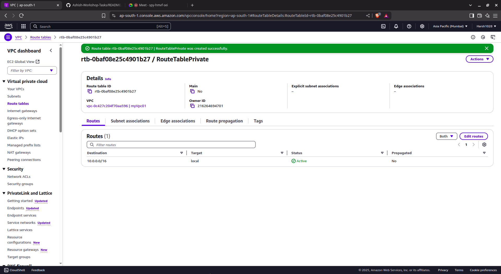
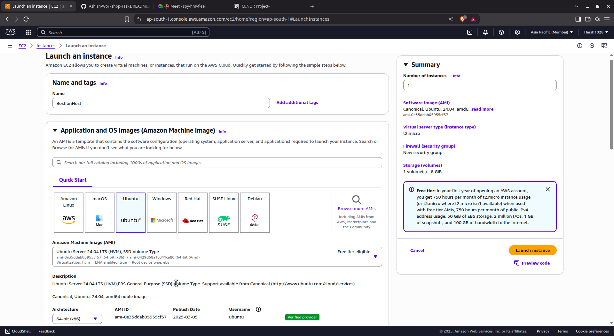
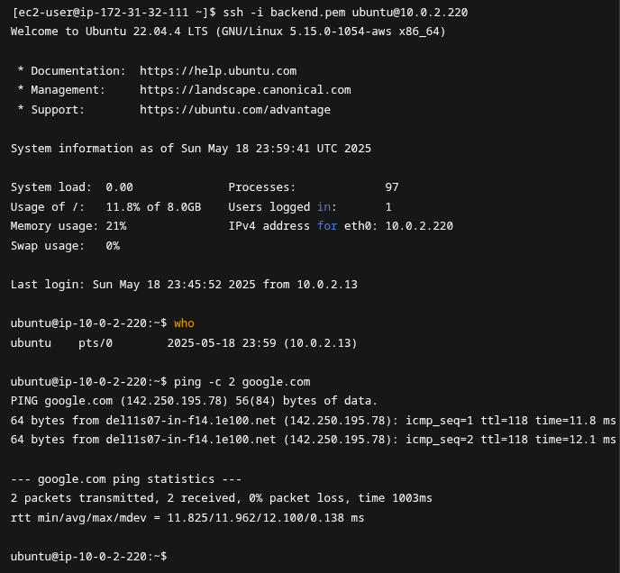

# AWS VPC: Public - Private Architecture Setup

*Author*: Harsh
*Reg No*: 11721210006
*Workshop Task Documentation*

---

## Task 1: Manual Setup via AWS Console

---

### 1. Create a VPC
- *Action*: Created a custom VPC with CIDR 10.0.0.0/16
- *Option Enabled*: DNS hostnames  
**

---

### 2. Create Subnets
- *Public Subnet*: 10.0.1.0/24  
**
- *Private Subnet*: 10.0.2.0/24 
 
- *Region/Zone*: e.g., ap-south-1  

---

### 3. Create and Attach Internet Gateway (IGW)
- *Step 1*: Created IGW
  
- *Step 2*: Attached IGW to the VPC
 

---

### 4. Allocate Elastic IP and Create NAT Gateway
- *Step 1*: Allocated Elastic IP 
 
- *Step 2*: Created NAT Gateway in Public Subnet using Elastic IP
  
- *Step 3*: Waited until status became "Available"

---

### 5. Create Route Tables

#### Public Route Table:
- *Step 1*: Created Public RT
 
- *Step 2*: Route added: 0.0.0.0/0 -> IGW
 
- *Step 3*: Associated with Public Subnet
 

#### Private Route Table:
- *Step 1*: Created Private RT
 
- *Step 2*: Route added: 0.0.0.0/0 -> NAT Gateway
 
- *Step 3*: Associated with Private Subnet
 

---

### 6. Configure Security Groups

#### Bastion SG
- *Inbound*: SSH (port 22) from My IP  
- *Outbound*: Allow All  

#### Backend EC2 SG
- *Inbound*: SSH (port 22) from 10.0.1.0/24  
- *Outbound*: Allow All  

---

### 7. Launch EC2 Instances

#### Bastion Host (Public Subnet)
- *AMI*: Amazon Linux 2  
- *Key Pair*: bastion.pem  
- *Subnet*: Public  
- *SG*: Bastion SG  

#### Backend EC2 (Private Subnet)
- *AMI*: Amazon Linux 2 / Ubuntu  
- *Key Pair*: Backend.pem  
- *Subnet*: Private  
- *SG*: Backend SG 

---

### 8. Validation Screenshots

#### VAlidate Bastion Access

#### Validate Backend Access and Internet Access

#### Updating Ubuntu ussing APT Update
